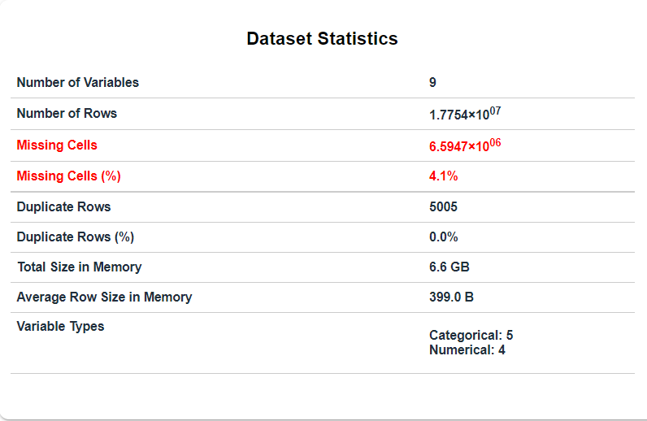
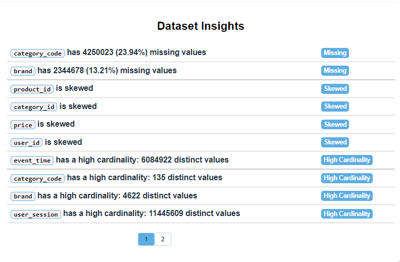
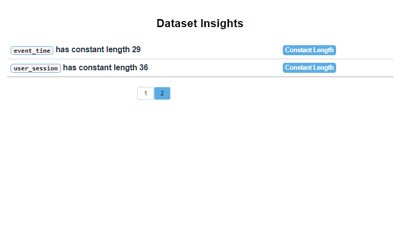

# Big Data project of an eCommerce behavior dataset
[](https://docs.scala-lang.org/)
[](https://spark.apache.org/docs/3.2.2/)
[](./LICENSE)
<!--This project is part of the evaluations within the Big Data Scala Trainee Program of Applaudo Studios.-->

Through this project, we seek to obtain key information for the marketing area on the behavior of consumers within the electronic commerce platform, with the main purpose of **creating sales strategies**.
Data such as the most purchased brands and products, the days of the week with the most interactions or the list of users who remain without finalizing the purchase, will contribute to defining key data for decision-making regarding measures such as the implementation of User Experience (UX) improvements on the platform, more advertising of star products that do not perceive the desired movement or complete development of commercial campaigns aimed at potential customers.


## 1. Dataset Description

### 1.1 Source and description

The Dataset used contains a total of 177,493,621 records, segmented into three files in csv format, one for each month between October and December 2019. You can consult part of the files published in [Kaggle](https://www.kaggle.com/datasets/mkechinov/ecommerce-behavior-data-from-multi-category-store) and the rest have been shared via [Google Drvie](https://drive.google.com/drive/folders/1Nan8X33H8xrXS5XhCKZmSpClFTCJsSpE) by [Michael Kechinov](https://www.linkedin.com/in/mkechinov/?originalSubdomain=ru)

Each record represents an event performed by a user regarding a product within a session, which is represented by a unique hash, each session can contain many events. Each event is like many-to-many relation between products and users.
#### File Structure
|    Column     | Description                                                                                                                                                      |
|:-------------:|------------------------------------------------------------------------------------------------------------------------------------------------------------------|
|  event_time   | Time when event happened at (in UTC).                                                                                                                            |
|  event_type   | Only one kind of event per register                                                                                                                              |
|  product_id   | ID of a product                                                                                                                                                  |
|  category_id  | Product's category ID                                                                                                                                            |
| category_code | Product's category taxonomy (code name) if it was possible to make it. Usually present for meaningful categories and skipped for different kinds of accessories. |
|     brand     | Downcast string of brand name. Can be missed.                                                                                                                    |
|     price     | Float price of a product. Present.                                                                                                                               |
|    user_id    | Permanent user ID.                                                                                                                                               |
| user_session  | Temporary user's session ID. Same for each user's session. Is changed every time user come back to online store from a long pause.                               |

#### Event types
Events can be:

- view - a user viewed a product
- cart - a user added a product to shopping cart
- purchase - a user purchased a product

#### How to read it
Semantics (or how to read it):
> User (**user_id**) during session (**user_session**) added to shopping cart (property **event_type** is equal *cart*) product (**product_id**) of **brand** of category (**category_code**) with **price** at **event_time**.

### 1.2 EDA report
#### Sample collection
The EDA results have been obtained from a 10% sample extracted using the function ``generateSample`` (see [Reader](./src/main/scala/Reader.scala)) which receives as parameters the path of the original dataset, the name of the file and the sampling fraction. More details about this feature are presented in the following sections.

#### Script
The Exploratory Data Analysis report was obtained with the help of the library [DataPrep](https://dataprep.ai/) supported by [Dask](https://www.dask.org/).

The script works as follows:
1. Through the ``read_parquet`` function (of the *dask.dataframe* component) the files are read in parquet format, specifying the *sourcePath* as a parameter. Get a dataframe (``df``).
2. From the obtained dataframe, the ``create_report`` function of the ``dataprep.eda`` component is used to generate the EDA report.
3. If you use a notebook such as Jupyter or Google Colab, you can directly display the result, simply by calling the ``report`` variable.
4. ``show_browser()`` allows you to open the report in the browser.
5. Finally, through the ``save`` function you can specify a path to save the result in html format.

```python
import dask.dataframe as dd
from dataprep.eda import create_report

df = dd.read_parquet("C:/data/sample/*.parquet") 
report = create_report(df)
report
report.show_browser()
report.save('C:/data/report.html')
```

#### Results
The following images show the *Overview* section of the EDA Report, in which we can highlight the following:
- The number of columns detected and analyzed is 9 and the number of records in the sample is approximately 17,754,000 ( $1,775*10^7$ ) rows.
- The missing cells are equivalent to 4.1%, which is barely acceptable for a margin of error of 5%. It should be taken into account that this percentage is based on the total number of cells, so the total number of rows with missing data could increase or decrease in the analysis of each column.
- The number of duplicate rows is 5005 (less than 1%), taking into account that each event represents a user action at a time with exact seconds, this represents possible incidents when registering in the DB; such as the network connection in client-server and server-DB communication (double sending of requests).
- We are shown the total size of the data in memory when processing it and something to take into account is the average value of row size.
- 5 categorical and 4 numerical variables are presented to take into account their formatting and treatment.

|                             |
|:-------------------------------------------------------------------------:|
| *Dataset Statistics. Overview section from the EDA Report with DataPrep.* |


- The *Dataset Insights* section presents a summary of each column.
- The *category_code* column has 23.94% of missing values, so if we decided to delete each of the rows that have those null values, we would be talking about shortening the fourth part of the dataset.
- The *brand* column has a 13.21% of missing values, taking into account that both this property and the *category_code* do not represent an impediment for the rows with those null values to have meaning as if they would be, for example, *event_type* or *event_time*; you can proceed to replace them with a value like *undefined* or *not specified*.
- It is also pointed out which columns are skewed and which have a high cardinality.

|                           |
|:-----------------------------------------------------------------------:|
| *Dataset Insights. Overview section from the EDA Report with DataPrep.* |

|                           |
|:-----------------------------------------------------------------------:|
| *Dataset Insights. Overview section from the EDA Report with DataPrep.* |

The full report is in the folder [data-profiling](./data-profiling)

### 1.3 Data Cleansing
The process to clean the data is done within the ``generateSample`` function which is also described later.
- Because the percentage of repeated values does not even reach 1%, they are eliminated
- The missing values that are presented in the *category_code* and *brand* columns are replaced with *unknown* and *not specified* since deleting those rows would represent a considerable loss of records. In addition, the values of these columns do not affect much the desired reports because the semantic meaning of each record does not depend so much on them.
- The column with timestamp values does not present malformed data, so it is only necessary to specify that the processes will be carried out in UTC format through the configuration specified in the ``Reader.scala`` object:
```scala
  //To perform patterns in dates
  spark.conf.set("spark.sql.legacy.timeParserPolicy", "LEGACY")

  //Set the timezone
  spark.conf.set("spark.sql.session.timeZone", "UTC")
```
- The required configuration has also been added from versions 3.x of spark to obtain *Legacy* behavior when using date formatting in certain reports.

## 2. How to execute the solution?

### 2.1 Arguments
- ``path``: The path directory of the files in csv format to read as the original dataset or a previously cleaned sample.
- ``isSample``: It can be ``true`` or ``false`` and defines whether the path corresponds to a clean sample or the original dataset directory. If it is ``false`` the application execute a process to clean the data and get a 30% sample, prior to the report generation processes.

### 2.2 Execution
- **Local mode**

  With a local installation of spark:
```shell
spark-submit --master local[*] ./target/scala-2.13/sparkpractice_2.13-0.3.0.jar <path> <isSample>
```
- **Spark Cluster with docker**

  Using the [configuration](./spark-cluster) of the RTJVM course:
  
  1. Copy the .jar file to *spark-cluster/apps*
  
  2. Copy the dataset or sample files to *spark-cluster/data*
  
  3. In a shell or terminal, go to the *spark-cluster* directory, and build the images with the next commands:
  ```shell
  docker build -t spark-base:latest ./docker/base
  docker build -t spark-master:latest ./docker/spark-master
  docker build -t spark-worker:latest ./docker/spark-worker
  docker build -t spark-submit:latest ./docker/spark-submit
  ```
  
  4. Start the services inside the docker-compose.yml file, with 3 workers:
  ```shell
  docker-compose up -d --scale spark-worker=3
  ```

  5. Exec the spark-master container:
  ```shell
  docker exec -it spark-cluster_spark-master_1 bash
  ```
  
  6. Inside the container, you can send the application via spark-submit:
  ```shell
  ./bin/spark-submit --deploy-mode client --master spark://<container-identifier>:7077 \
  --verbose --supervisor /opt/spark-apps/sparkpractice_2.13-0.3.0.jar opt/spark-data/ <isSample>
  ```


## 3. Dataset Insights and their reports 

### 3.1. What are the best-selling product categories (according to the number of events *"purchase"*)?
```scala
+-------------------+--------------------+-----------------------+----------------+-----------------------+----------------------+--------------+------------------+
|        category_id|       category_code|count_purchase_category|  sales_category|best_selling_product_id|count_purchase_product| sales_product|category_sales_per|
+-------------------+--------------------+-----------------------+----------------+-----------------------+----------------------+--------------+------------------+
|2053013555631882655|electronics.smart...|                218,908|$ 101,262,445.87|                1004856|                18,262|$ 2,360,562.29|            2.33 %|
|2232732093077520756|construction.tool...|                149,796| $ 64,414,035.78|                1004767|                10,362|$ 2,460,281.78|            3.82 %|
|2053013553559896355|       not specified|                 34,623|  $ 2,173,020.38|               12703015|                 1,243|   $ 53,837.53|            2.48 %|
|2053013554658804075|electronics.audio...|                 27,122|  $ 5,569,727.66|                4804056|                 9,125|$ 1,488,106.93|           26.72 %|
|2232732079706079299|       sport.bicycle|                 17,077|  $ 2,317,487.90|                4804056|                 6,778|$ 1,140,968.89|           49.23 %|
|2053013554415534427|electronics.video.tv|                 16,725|  $ 6,478,433.66|                1801690|                 1,745|  $ 670,157.04|           10.34 %|
|2232732099754852875|appliances.person...|                 12,109|  $ 4,779,707.75|                1801690|                 1,190|  $ 462,054.79|            9.67 %|
|2053013563810775923|appliances.kitche...|                 11,053|  $ 3,229,772.36|                3600661|                   966|  $ 292,230.03|            9.05 %|
|2053013558920217191|  computers.notebook|                 11,003|  $ 6,583,630.24|                1307310|                   670|  $ 192,857.96|            2.93 %|
|2053013565983425517|appliances.enviro...|                  9,477|  $ 1,364,463.91|                3700926|                 1,021|   $ 67,865.59|            4.97 %|
+-------------------+--------------------+-----------------------+----------------+-----------------------+----------------------+--------------+------------------+

```
The report shows the 10 categories with the most products purchased, in addition to indicating which is the product that contributed the most to sales. New measures can be implemented for categories that do not have as many purchase events, based on the possible reasons why these 10 categories have triumphed.

In addition, the high sales percentages (49.23%, 26.72%) indicate that the sales of this category are highly dependent on a single product. From this, a study could be started to determine what influences said behavior (such as pricing or advertising of other products in the category).

**Code**
```scala
//Get only the purchase events, each row with the column that contains the total number of events grouped by product and category.
val purchaseEventsDF = events2019DF
        .where(col("event_type")==="purchase")
        .withColumn(
          "count_purchase_product", count(lit(1)).over(wProduct)
        )
        .withColumn(
          "sales_product", sum(col("price")).over(wProduct)
        )

// Filter only the best product of each category according to the number of purchase events, eliminating duplicates
var df = purchaseEventsDF
        .withColumn(
          "count_purchase_category", count(lit(1)).over(wCategory)
        )
        .withColumn(
          "sales_category", sum(col("price")).over(wCategory)
        )
        .withColumn(
          "rank",dense_rank().over(wCategory.orderBy(col("count_purchase_product").desc_nulls_last))
        )
        .where(col("rank") === 1)
        .select("category_id","category_code","count_purchase_category","sales_category","product_id","count_purchase_product","sales_product")
        .distinct()

        //Sort by number of purchases per category, get only the best 10 categories and format the result
        .orderBy(col("count_purchase_category").desc_nulls_last)
        .limit(10)
        .select(
          col("category_id"),
          col("category_code"),
          format_number(col("count_purchase_category"),0).as("count_purchase_category"),
          currencyFormat(col("sales_category")).as("sales_category"),
          col("product_id").as("best_selling_product_id"),
          format_number(col("count_purchase_product"),0).as("count_purchase_product"),
          currencyFormat(col("sales_product")).as("sales_product"),
          percentageFormat(col("sales_product")/col("sales_category")).as("category_sales_per")
        )
```

### 3.2. What are the hours with the highest number of interactions?

```scala
+----+-----------+--------+----------+--------+--------------+------------+------------------+
|hour|total_views|view_per|total_cart|cart_per|total_purchase|purchase_per|total_interactions|
+----+-----------+--------+----------+--------+--------------+------------+------------------+
|  16|  3,470,866| 95.70 %|   113,828|  3.14 %|        42,147|      1.16 %|         3,626,841|
|  15|  3,390,133| 95.34 %|   120,494|  3.39 %|        45,167|      1.27 %|         3,555,794|
|  17|  3,287,257| 95.89 %|   102,548|  2.99 %|        38,308|      1.12 %|         3,428,113|
|  14|  3,172,301| 94.96 %|   120,055|  3.59 %|        48,176|      1.44 %|         3,340,532|
|  13|  2,848,708| 94.42 %|   119,367|  3.96 %|        49,098|      1.63 %|         3,017,173|
|   8|  2,776,368| 93.11 %|   143,915|  4.83 %|        61,454|      2.06 %|         2,981,737|
|   9|  2,747,584| 93.01 %|   143,161|  4.85 %|        63,303|      2.14 %|         2,954,048|
|   7|  2,695,396| 93.16 %|   140,023|  4.84 %|        57,993|      2.00 %|         2,893,412|
|  10|  2,685,072| 93.09 %|   138,859|  4.81 %|        60,354|      2.09 %|         2,884,285|
|   6|  2,650,691| 93.24 %|   136,317|  4.79 %|        55,909|      1.97 %|         2,842,917|
|  11|  2,600,839| 93.31 %|   130,809|  4.69 %|        55,615|      2.00 %|         2,787,263|
|  12|  2,589,451| 93.76 %|   121,364|  4.39 %|        50,845|      1.84 %|         2,761,660|
|  18|  2,582,678| 95.79 %|    86,164|  3.20 %|        27,443|      1.02 %|         2,696,285|
|   5|  2,499,660| 93.36 %|   126,269|  4.72 %|        51,429|      1.92 %|         2,677,358|
|   4|  2,206,725| 93.66 %|   106,433|  4.52 %|        42,924|      1.82 %|         2,356,082|
|  19|  1,789,060| 95.79 %|    58,543|  3.13 %|        20,152|      1.08 %|         1,867,755|
|   3|  1,717,073| 94.35 %|    75,290|  4.14 %|        27,612|      1.52 %|         1,819,975|
|   2|  1,176,777| 95.65 %|    41,151|  3.34 %|        12,422|      1.01 %|         1,230,350|
|  20|  1,061,639| 95.61 %|    36,343|  3.27 %|        12,406|      1.12 %|         1,110,388|
|  21|    620,531| 95.56 %|    21,213|  3.27 %|         7,589|      1.17 %|           649,333|
|   1|    609,895| 96.08 %|    19,772|  3.11 %|         5,142|      0.81 %|           634,809|
|  22|    380,090| 95.51 %|    12,965|  3.26 %|         4,897|      1.23 %|           397,952|
|   0|    357,963| 96.15 %|    10,883|  2.92 %|         3,461|      0.93 %|           372,307|
|  23|    284,209| 95.83 %|     8,979|  3.03 %|         3,390|      1.14 %|           296,578|
+----+-----------+--------+----------+--------+--------------+------------+------------------+
```
The report is ordered from the hours with the highest purchase events. A clear decrease in interactions can be observed between 9:00 p.m. and 1:00 a.m. and an increase between 1:00 p.m. and 5:00 p.m., which can help determine at what time of day it is convenient to execute strategies such as gift coupons, discounts, etc.

**Code**
```scala
//Extract the time from the 'event_time' column.
// Group all records according to time and, through the pivot function, get the count according to each of the three event types
df = events2019DF
      .withColumn("hour",hour(col("event_time")))
      .groupBy("hour")
      .pivot("event_type")
      .agg(count(lit(1)))

      //To the result, add the column with the total interactions and use it to obtain the percentage of each type of event
      .withColumn("total",col("view")+col("purchase")+col("cart"))
      .withColumn("view_per",percentageFormat(col("view")/col("total")))
      .withColumn("purchase_per",percentageFormat(col("purchase")/col("total")))
      .withColumn("cart_per",percentageFormat(col("cart")/col("total")))

      //Format the result and sort by total interactions
      .select(
        col("hour"),
        format_number(col("view"),0).as("total_views"),
        col("view_per"),
        format_number(col("cart"),0).as("total_cart"),
        col("cart_per"),
        format_number(col("purchase"),0).as("total_purchase"),
        col("purchase_per"),
        format_number(col("total"),0).as("total_interactions")
      )
      .orderBy(col("total").desc_nulls_last)
```

### 3.3. Products with the highest purchase recurrence per month
```scala
+---+--------+----------+-------+----------+----------+---------+----------------+
| No|   month|product_id|  brand|2-15 times|16-3 times|>30 times|total_recurrence|
+---+--------+----------+-------+----------+----------+---------+----------------+
|  1| October|   1004856|samsung|       766|         0|        0|             766|
|  2| October|   1004767|samsung|       576|         1|        0|             577|
|  3| October|   4804056|  apple|       386|         1|        0|             387|
|  4| October|   1005115|  apple|       345|         0|        0|             345|
|  5| October|   1004833|samsung|       343|         1|        0|             344|
|  6| October|   1002544|  apple|       302|         1|        0|             303|
|  7| October|   1004249|  apple|       284|         1|        0|             285|
|  8| October|   1004870|samsung|       272|         0|        0|             272|
|  9| October|   1005105|  apple|       207|         0|        0|             207|
| 10| October|   1004836|samsung|       205|         0|        0|             205|
|  1|November|   1004856|samsung|       840|         1|        1|             842|
|  2|November|   1005115|  apple|       659|         2|        0|             661|
|  3|November|   4804056|  apple|       533|         2|        0|             535|
|  4|November|   1004767|samsung|       512|         1|        0|             513|
|  5|November|   1004833|samsung|       327|         0|        1|             328|
|  6|November|   1002544|  apple|       318|         0|        0|             318|
|  7|November|   1004249|  apple|       234|         0|        0|             234|
|  8|November|   1005100|samsung|       226|         0|        0|             226|
|  9|November|   1004870|samsung|       210|         0|        0|             210|
| 10|November|   1005105|  apple|       192|         0|        0|             192|
|  1|December|   1004856|samsung|      1004|         2|        0|            1006|
|  2|December|   1004767|samsung|       926|         3|        1|             930|
|  3|December|   1005115|  apple|       833|         0|        0|             833|
|  4|December|   4804056|  apple|       723|         1|        1|             725|
|  5|December|   1005100|samsung|       639|         1|        1|             641|
|  6|December|   1002544|  apple|       611|         5|        1|             617|
|  7|December|   1004249|  apple|       364|         2|        1|             367|
|  8|December|   1005212|samsung|       318|         0|        0|             318|
|  9|December|   1004870|samsung|       299|         0|        0|             299|
| 10|December|   1005160| xiaomi|       293|         0|        0|             293|
+---+--------+----------+-------+----------+----------+---------+----------------+
```
The report presents the ten products with the highest purchase recurrence for each month, that is, those products that have been purchased more than once (in different user sessions) by the same customer.
This helps to know which products the customer has felt satisfied enough to buy again.

This information contributes to the creation of promotions in the style *get two and pay for three* or to make success stories known to customers or to emphasize the guarantee.

**Code**
```scala
val wMonth = Window.partitionBy("month")

//Extract the month from the 'event_time' column, select only the columns to identify the product, the brand, the month, the user and the user session.
//Filter only 'purchase' events and remove duplicates
df = events2019DF
      .withColumn("month",date_format(col("event_time"),"MMMM"))
      .select("product_id","brand", "month", "user_id","user_session")
      .where(col("event_type") === "purchase")
      .distinct()

      //Group the result in order to obtain the count of sessions in which the same user bought each product. (recurrence)
      .groupBy("product_id","brand", "month", "user_id") //how many times user_id has bought the same product in different sessions per month
      .agg(count(lit(1)).as("recurrence"))
      .where(col("recurrence") > 1)

      //Add a temporary column, to label each recurrence with its interval.
      .withColumn(
        "times",
        when(col("recurrence") > 1 && col("recurrence") < 16,"2-15")
          .when(col("recurrence") >= 16 && col("recurrence") < 31,"16-30")
          .otherwise(">30")
      )

      //Group according to product and month, obtain the recurrence count divided by intervals thanks to the pivot function
      .groupBy("product_id","brand","month")
      .pivot("times")
      .count()
      .na.fill(0) //anadir ceros en lugar de nullos

      //add the total recurrences and a rack to sort in descending order in each month
      .withColumn(
        "total_recurrence",
        col(">30")+col("16-30")+col("2-15")
      )
      .withColumn(
        "rank",
        dense_rank().over(wMonth.orderBy(col("total_recurrence").desc))
      )

      //Format the result and get only the 10 highest recurrences of each month
      .select(
        col("rank").as("No"),
        col("month"),
        col("product_id"),
        col("brand"),
        col("2-15").as("2-15 times"),
        col("16-30").as("16-3 times"),
        col(">30").as(">30 times"),
        col("total_recurrence")
      )
      .where(col("rank")<=10)
      .orderBy(col("month").desc,col("rank"))
```

### 3.4. How do sales of the most selling products evolve each month?
```scala
+----------+-------+--------------+--------------+--------------+--------------+--------------+--------------+-------------------+
|product_id|  brand|     Oct_total|Oct_percentage|     Nov_total|Nov_percentage|     Dec_total|Dec_percentage|total_sales_product|
+----------+-------+--------------+--------------+--------------+--------------+--------------+--------------+-------------------+
|   1005115|  apple|$ 3,761,462.62|        5.46 %|$ 6,195,131.03|        7.52 %|             0|             0|     $ 9,956,593.65|
|   1005115|  apple|             0|             0|             0|             0|$ 7,292,783.27|        7.06 %|     $ 7,292,783.27|
|   1005105|  apple|$ 2,946,326.88|        4.28 %|$ 3,346,744.03|        4.06 %|             0|             0|     $ 6,293,070.91|
|   1004249|  apple|$ 1,984,613.28|        2.88 %|$ 2,015,739.88|        2.45 %|             0|             0|     $ 4,000,353.16|
|   1005105|  apple|             0|             0|             0|             0|$ 3,918,880.53|        3.79 %|     $ 3,918,880.53|
|   1005135|  apple|$ 1,646,975.35|        2.39 %|$ 2,127,517.07|        2.58 %|             0|             0|     $ 3,774,492.42|
|   1004767|samsung|$ 1,621,748.35|        2.35 %|$ 1,669,771.86|        2.03 %|             0|             0|     $ 3,291,520.21|
|   1002544|  apple|$ 1,433,438.91|        2.08 %|$ 1,680,917.50|        2.04 %|             0|             0|     $ 3,114,356.41|
|   1002544|  apple|             0|             0|             0|             0|$ 2,625,201.52|        2.54 %|     $ 2,625,201.52|
|   1004249|  apple|             0|             0|             0|             0|$ 2,582,430.10|        2.50 %|     $ 2,582,430.10|
|   1004767|samsung|             0|             0|             0|             0|$ 2,460,281.78|        2.38 %|     $ 2,460,281.78|
|   1005135|  apple|             0|             0|             0|             0|$ 2,435,511.75|        2.36 %|     $ 2,435,511.75|
|   1004856|samsung|$ 1,140,413.15|        1.66 %|$ 1,220,149.14|        1.48 %|             0|             0|     $ 2,360,562.29|
|   1005116|  apple|             0|             0|             0|             0|$ 2,221,933.38|        2.15 %|     $ 2,221,933.38|
|   1005116|  apple|  $ 575,129.23|        0.84 %|$ 1,574,536.75|        1.91 %|             0|             0|     $ 2,149,665.98|
|   1002524|  apple|$ 1,049,228.90|        1.52 %|$ 1,026,294.97|        1.25 %|             0|             0|     $ 2,075,523.87|
|   1004870|samsung|  $ 916,887.10|        1.33 %|  $ 896,668.96|        1.09 %|             0|             0|     $ 1,813,556.06|
|   4804056|  apple|  $ 602,464.69|        0.87 %|  $ 885,642.24|        1.07 %|             0|             0|     $ 1,488,106.93|
|   1003317|  apple|  $ 846,343.34|        1.23 %|  $ 602,850.77|        0.73 %|             0|             0|     $ 1,449,194.11|
|   1004873|samsung|  $ 680,644.15|        0.99 %|  $ 678,282.10|        0.82 %|             0|             0|     $ 1,358,926.25|
+----------+-------+--------------+--------------+--------------+--------------+--------------+--------------+-------------------+
```
The report presents the ten products with the highest purchase recurrence for each month, that is, those products that have been purchased more than once (in different user sessions) by the same customer.
This helps to know which products the customer has felt satisfied enough to buy again.

This information contributes to the creation of promotions in the style *get two and pay for three* or to make success stories known to customers or to emphasize the guarantee.

**Code**
```scala
 //From the dataframe used in report 1 (the best-selling product categories) extract the month from the 'event_time' column and add the total sales per month.
//Group your sales by product and brand to obtain the total sales of each month and the percentage of the monthly total (in columns through the pivot function)
df = purchaseEventsDF
      .withColumn("month",date_format(col("event_time"),"MMM"))
      .withColumn("total_sales_month",sum("price").over(wMonth))
      .groupBy("product_id","sales_product","brand")
      .pivot("month")
      .agg(
        currencyFormat(sum(col("price"))).as("total"),
        percentageFormat(sum(col("price")/col("total_sales_month"))).as("percentage")
      )

      //Format the result, order by total product sales and limit to the 20 best selling products.
      .select(
        col("product_id"),
        col("brand"),
        col("Oct_total"),
        col("Oct_percentage"),
        col("Nov_total"),
        col("Nov_percentage"),
        col("Dec_total"),
        col("Dec_percentage"),
        currencyFormat(col("sales_product")).as("total_sales_product")
      )
      .orderBy(col("sales_product").desc)
      .na.fill("0") // Replace nulls with zeros
      .limit(20)
```

### 3.5. What is the day with the most sales revenue? And how much does it vary from the average daily sales?
   - Sales variability measures per date
```scala
+----------------+----------------+----------------+----------------+---------------+---------------+
|       min_sales|       max_sales|     range_sales|       avg_sales|         stddev|coefficient_var|
+----------------+----------------+----------------+----------------+---------------+---------------+
|$ 102,052,782.59|$ 598,269,912.18|$ 496,217,129.59|$ 164,874,826.28|$ 84,800,288.20|        51.43 %|
+----------------+----------------+----------------+----------------+---------------+---------------+
```
This table provides measures of variability for total daily sales. When analyzing the last three months of the year, the high season is expected to cause a large variation in daily sales, which is mainly reflected in the coefficient of variation that indicates that the values have a variation of 51% with respect to the average .

**Code**
```scala
//Filter only the 'purchase' events, extract the date from the 'event_time' column and group according to the latter to obtain a dataframe that indicates the total daily sales
val salesPerDateDF = events2019DF
      .where(col("event_type")==="purchase")
      .withColumn("date",date_format(col("event_time"),"yyyy-MM-dd"))
      .groupBy("date")
      .agg(
        sum("price").as("sales")
      )

//Generate a summary table with measures of variability (range, standard deviation, coefficient of variation) of daily sales
val salesVariationDF = salesPerDateDF
      .agg(
        max("sales").as("max"),
        min("sales").as("min"),
        avg("sales").as("avg"),
        stddev("sales").as("stddev")
      )
      .withColumn("range",col("max") - col("min"))
      .withColumn("coefficient_var",col("stddev")/col("avg"))

//Format the result of the summary table on the variability of daily sales
    df = salesVariationDF
      .select(
        currencyFormat(col("min")).as("min_sales"),
        currencyFormat(col("max")).as("max_sales"),
        currencyFormat(col("range")).as("range_sales"),
        currencyFormat(col("avg")).as("avg_sales"),
        currencyFormat(col("stddev")).as("stddev"),
        percentageFormat(col("coefficient_var")).as("coefficient_var")
      )
```

  - Variation of the dates with the most sales over the average sales
```scala
+----------+------------+----------------+-------------+
|      date|       sales|       deviation|deviation_per|
+----------+------------+----------------+-------------+
|2019-11-16|598269912.18|$ 433,395,085.90|     262.86 %|
|2019-11-15|567240828.87|$ 402,366,002.59|     244.04 %|
|2019-11-17|562288786.30|$ 397,413,960.02|     241.04 %|
|2019-11-14|297823857.75|$ 132,949,031.47|      80.64 %|
|2019-12-16|265500133.97|$ 100,625,307.69|      61.03 %|
|2019-12-17|247029245.04| $ 82,154,418.76|      49.83 %|
|2019-12-18|233252262.69| $ 68,377,436.41|      41.47 %|
|2019-12-29|219185656.30| $ 54,310,830.02|      32.94 %|
|2019-12-19|217985610.77| $ 53,110,784.49|      32.21 %|
|2019-12-22|214647059.56| $ 49,772,233.28|      30.19 %|
|2019-12-30|210998275.29| $ 46,123,449.01|      27.97 %|
|2019-12-20|208135705.06| $ 43,260,878.78|      26.24 %|
|2019-12-23|207578695.75| $ 42,703,869.47|      25.90 %|
|2019-12-21|202796619.67| $ 37,921,793.39|      23.00 %|
|2019-12-24|202021733.46| $ 37,146,907.18|      22.53 %|
|2019-12-25|199653719.49| $ 34,778,893.21|      21.09 %|
|2019-12-26|196754836.60| $ 31,880,010.32|      19.34 %|
|2019-12-15|192902504.39| $ 28,027,678.11|      17.00 %|
|2019-12-28|185013298.72| $ 20,138,472.44|      12.21 %|
|2019-12-27|180586806.07| $ 15,711,979.79|       9.53 %|
+----------+------------+----------------+-------------+
```
This report answers the question about the day with the most sales, which corresponds to November 16, 2019. In that same week (2019-11-14 to 2019-11-17) are the other 3 days with the highest sales of the quarter, The difference with the first three is very noticeable, since they obtained sales that exceed the daily average by more than 200%.

If these dates of the month of November correspond to a weekend with special promotions (such as a *black friday*) it can be determined if they are the expected results and based on them, plan more and better measures for the following year. The rest of the days belong, as you would expect in most businesses, to the month of December.

**Code**
```scala
 // From the table above, get the average daily sales
val salesAVG = salesVariationDF.select("avg").head().getDecimal(0)

//Add a column with the amount that each daily sale deviates from the average along with the percentage that this deviation represents with respect to said average
//Sort by daily sales and limit only to the best 20 days.
df = salesPerDateDF
      .withColumn(
        "deviation",
        currencyFormat(
          col("sales")-salesAVG
        )
      )
      .withColumn(
        "deviation_per",
        percentageFormat(
          (col("sales")-salesAVG)/salesAVG
        )
      )
      .orderBy(col("sales").desc)
      .limit(20)
```

### 3.6. Interactions avg according to days of the week
```scala
+---------+--------------+------------+----------+--------+----------+--------+------------------+
|      day|purchase_count|purchase_avg|cart_count|cart_avg|view_count|view_avg|total_interactions|
+---------+--------------+------------+----------+--------+----------+--------+------------------+
|   Sunday|        131949|        1.22|    252268|    1.46|   1037785|    7.76|           1422002|
|   Monday|        115301|        1.09|    230202|    1.25|   1034727|    6.66|           1380230|
|  Tuesday|        110829|        1.08|    220482|    1.22|   1098793|    6.34|           1430104|
| Saturday|        107597|        1.13|    248668|     1.4|   1044801|     7.4|           1401066|
|Wednesday|        101278|        1.07|    191002|     1.2|   1022341|    6.22|           1314621|
| Thursday|         99106|        1.07|    204142|    1.26|   1030645|    6.37|           1333893|
|   Friday|         98330|        1.07|    261000|    1.44|   1037122|    7.37|           1396452|
+---------+--------------+------------+----------+--------+----------+--------+------------------+

```
The report is sorted in descending order based on the average number of purchase events for each day. Something important to note is that, although the days with the highest average views are Friday, Saturday and Sunday, the best average purchase events are observed between Sunday and Tuesday of each week. Therefore, it can represent the result of advertising to users during the weekend or a point to take into account to start doing it.

**Code**
```scala
 // Interactions avg according to days of the week (Monday - Sunday)
//Add a temporary column with the value of 1, extract the day of week from the 'event_time' column
df = events2019DF
      .groupBy(col("event_time"),col("event_type"))
      .agg(count("event_time").as("temp_count"))
      .withColumn("day", date_format(col("event_time"), "EEEE"))

      //Group by date and use the temporary column to calculate the total of events according to the day of the week and its average
      // classify the count and average according to the type of event through the pivot function
      .groupBy(col("day"))
      .pivot("event_type")
      .agg(
        round(avg("temp_count"),2).as("avg"),
        count("temp_count").as("count")
      )

      // Sort the resulting columns, add the total of interactions and order according to the count of 'purchase' events
      .select("day","purchase_count","purchase_avg","cart_count","cart_avg","view_count","view_avg")
      .withColumn("total_interactions",col("purchase_count")+col("view_count")+col("cart_count"))
      .orderBy(col("purchase_count").desc_nulls_last)
```

### 3.7. How do the prices of the best-selling products vary?
```scala
+----------+-------+--------------+----------+--------+-------+---------------+
|product_id|  brand|   total_sales|       avg|   range| stddev|coefficient_var|
+----------+-------+--------------+----------+--------+-------+---------------+
|   1005115|  apple|$ 9,956,593.65|  $ 955.36|$ 102.97|$ 33.90|         3.55 %|
|   1005115|  apple|$ 7,292,783.27|  $ 901.62| $ 56.69|$ 18.19|         2.02 %|
|   1005105|  apple|$ 6,293,070.91|$ 1,371.96|$ 149.42|$ 35.67|         2.60 %|
|   1004249|  apple|$ 4,000,353.16|  $ 747.36|$ 127.82|$ 24.98|         3.34 %|
|   1005105|  apple|$ 3,918,880.53|$ 1,294.48| $ 62.71|$ 12.98|         1.00 %|
|   1005135|  apple|$ 3,774,492.42|$ 1,683.77|$ 128.57|$ 36.35|         2.16 %|
|   1004767|samsung|$ 3,291,520.21|  $ 247.68| $ 42.37| $ 6.06|         2.45 %|
|   1002544|  apple|$ 3,114,356.41|  $ 468.24| $ 41.44|$ 13.26|         2.83 %|
|   1002544|  apple|$ 2,625,201.52|  $ 455.83| $ 57.28|$ 14.43|         3.17 %|
|   1004249|  apple|$ 2,582,430.10|  $ 756.58| $ 71.58|$ 22.69|         3.00 %|
|   1004767|samsung|$ 2,460,281.78|  $ 236.84| $ 25.21| $ 7.06|         2.98 %|
|   1005135|  apple|$ 2,435,511.75|$ 1,649.53| $ 91.18|$ 23.57|         1.43 %|
|   1004856|samsung|$ 2,360,562.29|  $ 128.30| $ 11.80| $ 2.53|         1.97 %|
|   1005116|  apple|$ 2,221,933.38|  $ 972.92|$ 270.00|$ 31.15|         3.20 %|
|   1005116|  apple|$ 2,149,665.98|$ 1,025.71|$ 113.25|$ 36.75|         3.58 %|
|   1002524|  apple|$ 2,075,523.87|  $ 535.11| $ 72.64|$ 17.41|         3.25 %|
|   1004870|samsung|$ 1,813,556.06|  $ 283.28| $ 62.94| $ 9.25|         3.26 %|
|   4804056|  apple|$ 1,488,106.93|  $ 161.98| $ 11.87| $ 2.90|         1.79 %|
|   1003317|  apple|$ 1,449,194.11|  $ 958.20|$ 140.06|$ 32.43|         3.38 %|
|   1004873|samsung|$ 1,358,926.25|  $ 367.15| $ 69.22|$ 12.30|         3.35 %|
+----------+-------+--------------+----------+--------+-------+---------------+
```
Among the measures of variability of the 20 best products presented, it is a good sign that their price does not vary by more than 4%, which can be taken into account when launching new products or giving mobility to those who do not obtain the desired sales.

**Code**
```scala
//Select only the product identifier, mark the total sales per product and its price, then remove duplicates
df = purchaseEventsDF
      .select("product_id","brand","sales_product","price")
      .distinct()

      //Group by product to obtain price variability indicators for each product
      .groupBy("product_id","brand","sales_product")
      .agg(
        max("price").as("max"),
        min("price").as("min"),
        avg("price").as("avg"),
        stddev("price").as("stddev")
      )
      .withColumn("range",col("max") - col("min"))
      .withColumn("coefficient_var",col("stddev")/col("avg"))

      //Format the results, order according to products with the highest total sales and limit to the first 20
      .select(
        col("product_id"),
        col("brand"),
        currencyFormat(col("sales_product")).as("total_sales"),
        currencyFormat(col("avg")).as("avg"),
        currencyFormat(col("range")).as("range"),
        currencyFormat(col("stddev")).as("stddev"),
        percentageFormat(col("coefficient_var")).as("coefficient_var")
      )
      .orderBy(col("sales_product").desc)
      .limit(20)
```

## 4. Project structure
The solution is composed of two objects ([Reader](./src/main/scala/Reader.scala) and [InsightsGenerator](./src/main/scala/InsightsGenerator.scala)) that host the functions used to start the application from the object [Main](./src/main/scala/Main.scala).

- ``Rader.scala``. Within this, the only Spark session used in the application and the definition of the data schema is created, in addition, it continues the functions to read the data, create a dataframe and generate a sample.
  - ``readDF`` receives as parameters the path of the source directory, the format of the files (csv, parquet, etc.) and their name, in addition to the scheme to use. Return a dataframe from the specified parameters. 
  - ``generateSample`` this uses as arguments a source directory, the file name and the percentage of data to extract as a sample (range between 0.0 and 1.0), to read the files, eliminate duplicate records and, through the ``sample`` function , obtain a dataframe according to the specified sample size. Within this function, the null values of the *brand* and *category_code* columns are also replaced by the values *unknow* and *not specified* respectively, to finally write the results in parquet format, in a folder called *sample* within the same source directory. Returns the path of the directory containing the resulting sample.

```scala
def generateSample(sourcePath:String,originFileName:String="2019-*.csv",fraction:Double = 0.1):String = {
  
    val eventsDF = readDF(sourcePath,"csv",originFileName)

    /* ... */

    //Get a 10% (default) sample to optimize performance insights analysis on a PC
    eventsDF
      .distinct() //remove duplicate rows
      .sample(fraction)
      .na.fill(Map(
        "brand" -> "unknown",
        "category_code" -> "not specified"
      ))
      .write
      .format("parquet")
      .mode(SaveMode.Overwrite)
      .save(destinationPath)

    //Return the path of the sample
    destinationPath
}
```

- ``InsightsGenerator.scala``
  - ``saveResult`` receives the parameters: the dataframe, destination directory path, and the name of the report, which it uses to display the results in the console and write them in *csv* format into a folder with the same name as the report in the specified directory.
  - ``generateInsights`` takes care of reading the source data through ``readDF``, to then specify the queries for each insight and display/save their results through the ``saveResult`` function. Returns a success message at the end of the process.

```scala
def generateInsights(path: String): String = {

    val events2019DF = readDF(path, "parquet","*") //Read all files of the dataset
    val totalRows = events2019DF.count()

    // 10 best selling products
    var df = events2019DF
      .groupBy("product_id", "brand")
      .pivot("event_type")
      .count()
      .withColumn("sales_views_relation",round(col("purchase")/col("view"),3))
      .orderBy(col("purchase").desc_nulls_last)
      .limit(10)

    saveResult(df, path, "10-best-selling-products-with-their-sales-views-relation")

  /* ... */

    "\n\nReports save successfully."
  }
```
- ``Main.scala`` This object reads the *args* to get the origin path of the data and if it is a sample already prepared to generate the reports, otherwise it is responsible for generating it and uses the new path obtained to continue with the generation process. insights. Within this object is the error handling and, if needed, the instructions are printed on the console.
  - ``getPath`` receives an array of strings, the first corresponds to a path of the directory that contains the data to be analyzed and the second specifies whether it belongs to a sample already prepared (*true*) or the complete dataset (*false*), in the latter case calls the ``generateSample`` function to generate a new sample. Returns the path of the directory that contains the data to use.

```scala
//Get the success message after execute the generating reports process
  var message:Try[String] = Try(generateInsights(getPath(args)))

  message match {
    case Success(msg:String) => {
      println(msg)
      println(s"\nIrene Delgado, August 2022")
    }
    /* ... */
    case Failure(e:AnalysisException) => {
      println("An error occurred while processing the report. ")
      println(e.getMessage())
      printInstructions()
    }
    case Failure(e) => print(e.getMessage)
  }

  /* ... */

  //Define the path of the container folder of the dataset sample
  def getPath(args:Array[String]):String =
    //If the path is the whole dataset, generate an sample and return the path
    if (!args(1).toBoolean) generateSample(args(0), "*.csv",0.3) 
    else args(0) //else return the original path
```

## 5. Challenges during development

## 6. Comments
