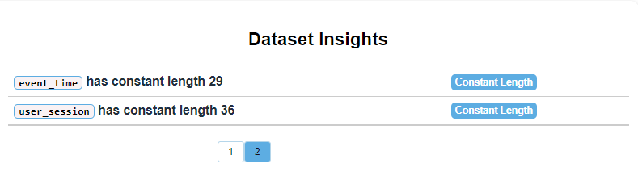

# Big Data project of an eCommerce behavior dataset
This project is part of the evaluations within the Big Data Scala Trainee Program of Applaudo Studios
## 1. Dataset Description
### 1.1 Source and description

The Dataset used contains a total of 177,493,621 records, segmented into three files in csv format, one for each month between October and December 2019. You can consult part of the files published in [Kaggle](https://www.kaggle.com/datasets/mkechinov/ecommerce-behavior-data-from-multi-category-store) and the rest have been shared via [Google Drvie](https://drive.google.com/drive/folders/1Nan8X33H8xrXS5XhCKZmSpClFTCJsSpE) by [Michael Kechinov](https://www.linkedin.com/in/mkechinov/?originalSubdomain=ru)

Each record represents an event performed by a user regarding a product within a session, which is represented by a unique hash, each session can contain many events. Each event is like many-to-many relation between products and users.
#### File Structure
|    Column     | Description                                                                                                                                                      |
|:-------------:|------------------------------------------------------------------------------------------------------------------------------------------------------------------|
|  event_time   | Time when event happened at (in UTC).                                                                                                                            |
|  event_type   | Only one kind of event per register                                                                                                                              |
|  product_id   | ID of a product                                                                                                                                                  |
|  category_id  | Product's category ID                                                                                                                                            |
| category_code | Product's category taxonomy (code name) if it was possible to make it. Usually present for meaningful categories and skipped for different kinds of accessories. |
|     brand     | Downcast string of brand name. Can be missed.                                                                                                                    |
|     price     | Float price of a product. Present.                                                                                                                               |
|    user_id    | Permanent user ID.                                                                                                                                               |
| user_session  | Temporary user's session ID. Same for each user's session. Is changed every time user come back to online store from a long pause.                               |

#### Event types
Events can be:

- view - a user viewed a product
- cart - a user added a product to shopping cart
- remove_from_cart - a user removed a product from shopping cart
- purchase - a user purchased a product

#### How to read it
Semantics (or how to read it):
> User (**user_id**) during session (**user_session**) added to shopping cart (property **event_type** is equal *cart*) product (**product_id**) of **brand** of category (**category_code**) with **price** at **event_time**.

### 1.2 EDA report
#### Obtencion de la muestra
The EDA results have been obtained from a 10% sample extracted using the function ``generateSample`` (see [Reader](./src/main/scala/Reader.scala)) which receives as parameters the path of the original dataset, the name of the file and the sampling fraction. More details about this feature are presented in the following sections.

#### Script
The Exploratory Data Analysis report was obtained with the help of the library [DataPrep](https://dataprep.ai/) supported by [Dask](https://www.dask.org/).

The script works as follows:
1. Through the ``read_parquet`` function (of the *dask.dataframe* component) the files are read in parquet format, specifying the *sourcePath* as a parameter. Get a dataframe (``df``).
2. From the obtained dataframe, the ``create_report`` function of the ``dataprep.eda`` component is used to generate the EDA report.
3. If you use a notebook such as Jupyter or Google Colab, you can directly display the result, simply by calling the ``report`` variable.
4. ``show_browser()`` allows you to open the report in the browser.
5. Finally, through the ``save`` function you can specify a path to save the result in html format.

```python
import dask.dataframe as dd
from dataprep.eda import create_report

df = dd.read_parquet("C:/data/sample/*.parquet") 
report = create_report(df)
report
report.show_browser()
report.save('C:/data/report.html')
```

#### Results
The following images show the *Overview* section of the EDA Report, in which we can highlight the following:
- The number of columns detected and analyzed is 9 and the number of records in the sample is approximately 17,754,000 ( $1,775*10^7$ ) rows.
- The missing cells are equivalent to 4.1%, which is barely acceptable for a margin of error of 5%. It should be taken into account that this percentage is based on the total number of cells, so the total number of rows with missing data could increase or decrease in the analysis of each column.
- The number of duplicate rows is 5005 (less than 1%), taking into account that each event represents a user action at a time with exact seconds, this represents possible incidents when registering in the DB; such as the network connection in client-server and server-DB communication (double sending of requests).
- We are shown the total size of the data in memory when processing it and something to take into account is the average value of row size.
- 5 categorical and 4 numerical variables are presented to take into account their formatting and treatment.

|                             |
|:-------------------------------------------------------------------------:|
| *Dataset Statistics. Overview section from the EDA Report with DataPrep.* |


- The *Dataset Insights* section presents a summary of each column.
- The *category_code* column has 23.94% of missing values, so if we decided to delete each of the rows that have those null values, we would be talking about shortening the fourth part of the dataset.
- The *brand* column has a 13.21% of missing values, taking into account that both this property and the *category_code* do not represent an impediment for the rows with those null values to have meaning as if they would be, for example, *event_type* or *event_time*; you can proceed to replace them with a value like *undefined* or *not specified*.
- It is also pointed out which columns are skewed and which have a high cardinality.

|                           |
|:-----------------------------------------------------------------------:|
| *Dataset Insights. Overview section from the EDA Report with DataPrep.* |

|                           |
|:-----------------------------------------------------------------------:|
| *Dataset Insights. Overview section from the EDA Report with DataPrep.* |

The full report is in the folder [data-profiling](./data-profiling)
## 2. Environment

## 3. How to execute the solution?

## 4. Dataset Insights and their reports 

The reports have been obtained with a sample of 30% of the original dataset.

### 4.1 Top 10 selling products and their sales views relation

```scala
+----------+-------+-----+--------+------+--------------------+
|product_id|  brand| cart|purchase|  view|sales_views_relation|
+----------+-------+-----+--------+------+--------------------+
|   1004856|samsung|64182|   28631|447727|               0.064|
|   1004767|samsung|58107|   23483|469107|                0.05|
|   1005115|  apple|42581|   18391|420578|               0.044|
|   4804056|  apple|39885|   15933|232602|               0.068|
|   1002544|  apple|24662|   12145|195653|               0.062|
|   1005100|samsung|28675|   11395|193823|               0.059|
|   1004870|samsung|27745|   10582|224965|               0.047|
|   1004833|samsung|20625|    9530|168320|               0.057|
|   1004249|  apple|19692|    8880|203360|               0.044|
|   1005105|  apple|16937|    7843|216721|               0.036|
+----------+-------+-----+--------+------+--------------------+
```
### 4.2 The 10 days with the most interactions (events)
```scala
+----------+------------+
|event_date|interactions|
+----------+------------+
|2019-11-16|     1916591|
|2019-11-15|     1831710|
|2019-11-17|     1690072|
|2019-11-14|     1227217|
|2019-12-16|      921603|
|2019-12-17|      893086|
|2019-12-18|      848676|
|2019-12-29|      820926|
|2019-12-19|      814858|
|2019-12-22|      814274|
+----------+------------+
```

### 4.3 Top 5 selling product categories
```scala
+-------------------+--------------------+------+
|        category_id|       category_code| sales|
+-------------------+--------------------+------+
|2053013555631882655|electronics.smart...|218667|
|2232732093077520756|construction.tool...|149961|
|2053013553559896355|       not specified| 34617|
|2053013554658804075|electronics.audio...| 27209|
|2053013554415534427|electronics.video.tv| 17173|
+-------------------+--------------------+------+
```
### 4.4 The 5 brands with the most interaction
```scala
+-------+------------+----------+
|  brand|interactions|percentage|
+-------+------------+----------+
|samsung|     6513225|     12.23|
|  apple|     4793253|       9.0|
| xiaomi|     3880800|      7.29|
| huawei|     1329123|       2.5|
|lucente|      932478|      1.75|
+-------+------------+----------+
```

### 4.5 Interactions avg according to days of the week
```scala
+---------+----+--------+----+
|      day|cart|purchase|view|
+---------+----+--------+----+
|   Sunday|1.47|    1.21|7.63|
| Saturday|1.42|    1.14|7.38|
|   Monday|1.27|    1.09|6.59|
|  Tuesday|1.24|    1.08|6.34|
| Thursday|1.35|    1.07|6.64|
|Wednesday|1.22|    1.07|6.23|
|   Friday|1.45|    1.07|7.31|
+---------+----+--------+----+
```

## 5. Project structure
The solution is composed of two objects ([Reader](./src/main/scala/Reader.scala) and [InsightsGenerator](./src/main/scala/InsightsGenerator.scala)) that host the functions used to start the application from the object [Main](./src/main/scala/Main.scala).

- ``Rader.scala``. Within this, the only Spark session used in the application and the definition of the data schema is created, in addition, it continues the functions to read the data, create a dataframe and generate a sample.
  - ``readDF`` receives as parameters the path of the source directory, the format of the files (csv, parquet, etc.) and their name, in addition to the scheme to use. Return a dataframe from the specified parameters. 
  - ``generateSample`` this uses as arguments a source directory, the file name and the percentage of data to extract as a sample (range between 0.0 and 1.0), to read the files, eliminate duplicate records and, through the ``sample`` function , obtain a dataframe according to the specified sample size. Within this function, the null values of the *brand* and *category_code* columns are also replaced by the values *unknow* and *not specified* respectively, to finally write the results in parquet format, in a folder called *sample* within the same source directory. Returns the path of the directory containing the resulting sample.

```scala
def generateSample(sourcePath:String,originFileName:String="2019-*.csv",fraction:Double = 0.1):String = {
  
    val eventsDF = readDF(sourcePath,"csv",originFileName)

    /* ... */

    //Get a 10% (default) sample to optimize performance insights analysis on a PC
    eventsDF
      .distinct() //remove duplicate rows
      .sample(fraction)
      .na.fill(Map(
        "brand" -> "unknown",
        "category_code" -> "not specified"
      ))
      .write
      .format("parquet")
      .mode(SaveMode.Overwrite)
      .save(destinationPath)

    //Return the path of the sample
    destinationPath
}
```

- ``InsightsGenerator.scala``
  - ``saveResult`` receives the parameters: the dataframe, destination directory path, and the name of the report, which it uses to display the results in the console and write them in *csv* format into a folder with the same name as the report in the specified directory.
  - ``generateInsights`` takes care of reading the source data through ``readDF``, to then specify the queries for each insight and display/save their results through the ``saveResult`` function. Returns a success message at the end of the process.

```scala
def generateInsights(path: String): String = {

    val events2019DF = readDF(path, "parquet","*") //Read all files of the dataset
    val totalRows = events2019DF.count()

    // 10 best selling products
    var df = events2019DF
      .groupBy("product_id", "brand")
      .pivot("event_type")
      .count()
      .withColumn("sales_views_relation",round(col("purchase")/col("view"),3))
      .orderBy(col("purchase").desc_nulls_last)
      .limit(10)

    saveResult(df, path, "10-best-selling-products-with-their-sales-views-relation")

  /* ... */

    "\n\nReports save successfully."
  }
```
- ``Main.scala`` This object reads the *args* to get the origin path of the data and if it is a sample already prepared to generate the reports, otherwise it is responsible for generating it and uses the new path obtained to continue with the generation process. insights. Within this object is the error handling and, if needed, the instructions are printed on the console.
  - ``getPath`` receives an array of strings, the first corresponds to a path of the directory that contains the data to be analyzed and the second specifies whether it belongs to a sample already prepared (*true*) or the complete dataset (*false*), in the latter case calls the ``generateSample`` function to generate a new sample. Returns the path of the directory that contains the data to use.

```scala
//Get the success message after execute the generating reports process
  var message:Try[String] = Try(generateInsights(getPath(args)))

  message match {
    case Success(msg:String) => {
      println(msg)
      println(s"\nIrene Delgado, August 2022")
    }
    /* ... */
    case Failure(e:AnalysisException) => {
      println("An error occurred while processing the report. ")
      println(e.getMessage())
      printInstructions()
    }
    case Failure(e) => print(e.getMessage)
  }

  /* ... */

  //Define the path of the container folder of the dataset sample
  def getPath(args:Array[String]):String =
    //If the path is the whole dataset, generate an sample and return the path
    if (!args(1).toBoolean) generateSample(args(0), "*.csv",0.3) 
    else args(0) //else return the original path
```
## 6. Challenges during development
## 7. Comments
